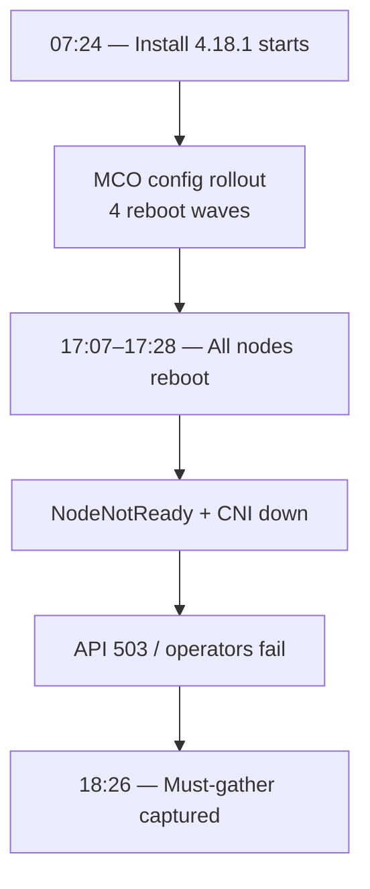

# OpenShift SRE Incident Report — pkhblocphcprod

> **Status:** Failing · **Severity:** High · **Source:** must-gather · **OCP:** 4.18.1

---

## At a Glance

| | |
|:--|:--|
| **Cluster** | `pkhblocphcprod.domestic.hbl.com` |
| **OpenShift** | 4.18.1 — Partial install (started 12 Aug 07:24 UTC) |
| **Primary cause** | MCO rolling node reboots during initial bring-up; APIs still recovering at capture |
| **Impact window** | 12 Aug 17:07 → 18:30 UTC (acute); install ongoing ~11 h |
| **Top P0 action** | Confirm MCO rollout complete — all nodes Ready, pools UPDATED |

| | |
|:--|:--|
| **Secondary** | ingress-operator BackOff · monitoring ImagePolicy/503 · marketplace pulls · 31K etcd events |
| **Ruled out** | etcd failure · network partition · ingress data plane down |
| **etcd** | 3/3 healthy · no alarms · 31,617 events (elevated) |

### Report metadata

| Field | Value |
|:--|:--|
| Report ID | RCA-MG-20250812-001 |
| Gather time | 2025-08-12 18:26–18:32 UTC |
| Analysis time | 2026-09-11 21:02 UTC (re-run) |
| Tool | kubernetes-mcp-server (`agents/sre/sre-agent.toml`) |
| Bundle | `/Users/rgangwar/Downloads/must-gather.local.7676646060719736617.tar.gz` |

---

## Contents

1. [Executive Summary](#1-executive-summary)
2. [Chain of Events](#2-chain-of-events)
3. [Primary Root Cause](#3-primary-root-cause)
4. [Secondary Causes](#4-secondary--contributing-causes)
5. [Impact Assessment](#5-impact-assessment)
6. [Cluster State](#6-cluster-state-at-capture)
7. [Remediation](#7-recommended-remediation)
8. [Workflow](#8-shareable-workflow)
9. [Appendix](#9-appendix--key-evidence)

---

## 1. Executive Summary

On **12 Aug 2025**, cluster **pkhblocphcprod** (on-prem, 3 CP + 3 workers) was captured **~11 hours into a fresh OCP 4.18.1 install**. ClusterVersion was still **Partial** with four operators unavailable.

The **primary cause** is a **cluster-wide rolling reboot sequence** from the Machine Config Operator during initial config rollout — **25 `Rebooted` events** across all six nodes (09:51–17:28 UTC). The final wave (17:07–17:28) caused sequential `NodeNotReady`, kube-apiserver readyz failures, and OpenShift API **503** errors at must-gather capture time.

**etcd was healthy** throughout (3 members, no alarms). Secondary issues — ingress-operator crash loop, monitoring degradation, marketplace image pulls — amplified impact but did not initiate the outage.

| | |
|:--|:--|
| **Primary cause** | MCO-driven rolling reboots during OCP 4.18.1 install; capture taken mid-recovery |
| **Secondary causes** | ingress-operator BackOff, monitoring ImagePolicy/503, registry pulls, event bloat |
| **Ruled out** | etcd failure, network partition, ingress controller outage |

---

## 2. Chain of Events

### Visual flow



### One-line chain

> Partial install → MCO reboots (×25) → NodeNotReady + API/CNI startup → APIService 503 → 4 operators down → must-gather snapshot

### Timeline — critical window

| # | Time (UTC) | Event | Impact |
|:-:|---|---|---|
| 1 | 17:07 | NodeNotReady on **m2** (CP) | CP scheduling blocked |
| 2 | 17:10–17:23 | Sequential reboots: w1 → m2 → w2 → m1 → w3 | Rolling fleet disruption |
| 3 | 17:24 | NodeNotReady on **m3**; etcd/apiserver pods affected | API/etcd static pods down |
| 4 | 17:28 | **m3 rebooted**; CNI `NetworkPluginNotReady` | Networking blocked on m3 |
| 5 | 17:28 | kube-apiserver readyz **500** | Core API aggregation degraded |
| 6 | 18:28 | ClusterVersion **Failing=True** | auth, monitoring, apiserver, samples down |
| 7 | 18:26 | Must-gather collected | Degraded state frozen |

<details>
<summary><strong>Full timeline</strong> (install + earlier reboot waves)</summary>

| # | Time (UTC) | Event | Component |
|:-:|---|---|---|
| 1 | 07:24 | Install starts, state Partial | CVO |
| 2 | 07:28 | Marketplace image pull BackOff | OLM |
| 3 | 09:43 | ingress-operator BackOff begins | Ingress operator |
| 4 | 09:51–10:28 | Reboot wave 1 — all nodes | MCO |
| 5 | 13:06–13:36 | Reboot wave 2 | MCO |
| 6 | 15:18–15:43 | Reboot wave 3 | MCO |
| 7 | 17:07–18:30 | Reboot wave 4 + API recovery window | MCO / API |
| 8 | 18:29 | OpenShiftAPICheckFailed 503 | openshift-apiserver |

</details>

---

## 3. Primary Root Cause

| | |
|:--|:--|
| **Statement** | Rolling **node reboots** during initial OCP 4.18.1 bring-up (MCO machine config rollout). Final wave left CP/API components not yet recovered at capture. |
| **Evidence** | 25 `Rebooted` events on all 6 nodes · machine-config Available=True, all nodes at latest rendered config · sequential NodeNotReady 17:07–17:28 · readyz 500 after m3 reboot |
| **Mechanism** | MCO drains/reboots each node to apply rendered configs. Each reboot restarts static pods (apiserver, etcd, scheduler) and re-initializes CNI. Sequential CP+worker reboots drop aggregated API availability until convergence. |
| **Why it mattered** | Must-gather taken **during recovery** (~60 min after last CP reboot). ClusterVersion showed Failing and operators reported 503/timeouts — looks like outage, but consistent with incomplete post-reboot convergence on fresh install. |

### Ruled out (not root cause)

| Component | Verdict | Why |
|:--|:--|:--|
| etcd | Not root | 3/3 healthy, no alarms, raft term 18 |
| etcd capacity | Not root | DB ~135–141 MB; leader elected |
| Network partition | Not root | Reboot events explain NodeNotReady |
| Ingress data plane | Not root | Ingress CO Available=True; operator pod BackOff is secondary |

---

## 4. Secondary / Contributing Causes

| Category | Issue | Evidence | Impact |
|:--|:--|:--|:--|
| **Operators** | ingress-operator crash loop | BackOff 09:43–17:25 UTC | Operator reconciliation impaired |
| **Operators** | authentication down | oauth APIService 503 | Login/oauth unavailable |
| **Operators** | openshift-apiserver down | route/image/build APIServices 503 | Platform APIs unreachable |
| **Operators** | openshift-samples down | imagestream PUT 503 | Sample templates missing |
| **Monitoring** | monitoring degraded | ImagePolicy timeout 13s; route get 503 | No monitoring stack at capture |
| **Registry** | marketplace pulls | BackOff on registry.redhat.io indexes | OLM catalogs delayed |
| **etcd** | event bloat | 31,617 events vs 221 pods | Extra API/etcd load during install |
| **Network** | CNI post-reboot | `NetworkPluginNotReady` on rebooted nodes | Transient until Multus/OVN up |

---

## 5. Impact Assessment

| Area | Impact | Duration |
|:--|:--|:--|
| Cluster availability | CV Failing; platform APIs 503 | Acute: 17:07–18:30 UTC; install ~11 h |
| Authentication / Console | OAuth 503; console probes failing | ~17:21 → capture |
| Monitoring | Operator Degraded; Prometheus routes 503 | ~18:27 → capture |
| OLM / Marketplace | Catalog ImagePullBackOff | Intermittent from 07:28 UTC |
| Ingress (data plane) | Default controller Available | Minimal user impact |
| Workloads | NodeNotReady per reboot wave | ~5–15 min/node × 4 waves |

---

## 6. Cluster State at Capture

**Topology:** 3 control-plane (`m1`–`m3`) + 3 workers (`w1`–`w3`) · 68 namespaces · 33,939 resources indexed

### Nodes

| Node | Role | Reboot times (UTC, sample) |
|:--|:--|:--|
| m1 (`pkhblhcm1…`) | CP | 09:19 · 13:28 · 15:43 · 17:19 |
| m2 (`pkhblhcm2…`) | CP | 10:28 · 13:20 · 15:20 · 17:11 |
| m3 (`pkhblhcm3…`) | CP | 10:22 · 13:36 · 15:32 · **17:28** |
| w1 (`pkhblhcw1…`) | Worker | 09:51 · 13:21 · 15:18 · 17:10 |
| w2 (`pkhblhcw2…`) | Worker | 09:56 · 13:28 · 15:28 · 17:16 |
| w3 (`pkhblhcw3…`) | Worker | 10:00 · 13:35 · 15:37 · 17:23 |

### etcd

| Metric | Value |
|:--|:--|
| Members | 3 (m1, m2, m3) — all healthy |
| Alarms | None |
| Version | 3.5.17 · revision 340442 |
| Events in etcd | **31,617** (elevated) |

### Cluster operators

| Operator | Avail | Degraded | Summary |
|:--|:-:|:-:|:-:|
| authentication | No | Yes | oauth APIService 503 |
| monitoring | No | Yes | ImagePolicy timeout |
| openshift-apiserver | No | No | APIServices 503 |
| openshift-samples | No | No | imagestream PUT 503 |
| machine-config | Yes | No | All nodes at latest config |
| ingress | Yes | No | Data plane OK |

### Problem pods (top 5)

| Pod | Namespace | Symptom |
|:--|:--|:--|
| `ingress-operator-*` | openshift-ingress-operator | BackOff |
| `apiserver-*` | openshift-apiserver | Readiness 500 |
| `kube-apiserver-m3` | openshift-kube-apiserver | readyz 500 |
| `redhat-operators-*` | openshift-marketplace | ImagePullBackOff |
| `network-node-identity-*` | openshift-network-node-identity | BackOff |

---

## 7. Recommended Remediation

### P0 — Do now

| # | Action | Why |
|:-:|---|---|
| 1 | Verify MCO complete — all nodes **Ready**, pools **UPDATED** | Distinguish mid-rollout vs real outage |
| 2 | Wait 15–30 min post-last reboot; re-check ClusterVersion | APIs may self-heal after convergence |
| 3 | Debug ingress-operator crash loop (logs, previous container) | Ongoing failure independent of reboots |
| 4 | Fix registry/mirror for `registry.redhat.io` and `quay.io` | Unblocks marketplace and install |

### P1 — This week

| # | Action | Why |
|:-:|---|---|
| 1 | Tune ImagePolicy / registry under API load | Monitoring operator recovery |
| 2 | Investigate 31K events on fresh cluster | Reduce etcd/API noise |
| 3 | Capture must-gather only when CV Available or post-incident | Avoid false-positive outage reports |
| 4 | Verify oauth-apiserver endpoints after apiserver recovery | Clears authentication CO |

### P2 — Prevent recurrence

| # | Action | Why |
|:-:|---|---|
| 1 | Schedule node updates in maintenance windows | Controlled reboot cadence |
| 2 | Pre-pull catalog images in disconnected env | Faster OLM startup |
| 3 | Plan upgrade to 4.18.21 after stable | Current: 4.18.1 partial |

---

## 8. Shareable Workflow

### Tools used

| Step | Tool | Purpose |
|:-:|---|---|
| 1 | `tar -xzf` | Extract bundle |
| 2 | `mustgather_use` | Load 33,939 resources |
| 3 | `mustgather_resources_list` | Nodes, ClusterOperator, ClusterVersion |
| 4 | `mustgather_events_list` | Warning, Rebooted, NodeNotReady, BackOff |
| 5 | `etcd_info/*.json` (raw) | etcd health — MCP parse failed on 4.18 format |
| 6 | `mustgather_resources_list` | auth, monitoring, ingress, machine-config COs |

### Reproduce

```bash
tar -xzf must-gather.local.7676646060719736617.tar.gz -C /tmp/mg-extracted/
# /must-gather-rca /tmp/mg-extracted/.../registry-redhat-io-openshift4-ose-must-gather-sha256-16642045...
```

### Who gets what

| Audience | Share |
|:--|:--|
| SRE / Platform | Full report |
| Management | At a Glance + §1 + §5 + P0 table |
| Red Hat support | Full report + bundle path + OCP 4.18.1 Partial state |

---

## 9. Appendix — Key Evidence

<details>
<summary><strong>ClusterVersion — Failing condition</strong></summary>

```
message: Cluster operators authentication, monitoring, openshift-apiserver,
         openshift-samples are not available
reason:  ClusterOperatorsNotAvailable
type:    Failing
status:  "True"
```

</details>

<details>
<summary><strong>Trigger — Rebooted event (m3)</strong></summary>

```
2025-08-12T17:28:05Z  Warning  Rebooted  Node/pkhblhcm3
Node pkhblhcm3.pkhblocphcprod.domestic.hbl.com has been rebooted,
boot id: 04652cde-9231-469e-aa17-fe9abcb946fa
```

</details>

<details>
<summary><strong>Symptom — kube-apiserver readyz failure</strong></summary>

```
2025-08-12T17:28:17Z  Warning  ProbeError  Pod/kube-apiserver-pkhblhcm3
[-]api-openshift-apiserver-available failed
[-]api-openshift-oauth-apiserver-available failed
readyz check failed
```

</details>

<details>
<summary><strong>Monitoring operator — Degraded</strong></summary>

```
ImagePolicy failed to complete mutation in 13s
get routes.route.openshift.io prometheus-k8s: server unable to handle request
reason: MultipleTasksFailed · type: Degraded · status: "True"
```

</details>

<details>
<summary><strong>etcd health (raw bundle)</strong></summary>

```json
[
  {"endpoint":"https://10.200.213.72:2379","health":true},
  {"endpoint":"https://10.200.213.73:2379","health":true},
  {"endpoint":"https://10.200.213.74:2379","health":true}
]
{"events":"31617","pods":"221","configmaps":"582"}
```

</details>

<details>
<summary><strong>Full bundle path</strong></summary>

```
/Users/rgangwar/Downloads/must-gather.local.7676646060719736617.tar.gz
/tmp/mg-extracted/must-gather.local.7676646060719736617/registry-redhat-io-openshift4-ose-must-gather-sha256-16642045fbadf1c423ff553436844aa46d11be5cbe81822bd59aa65ec43a3e13
```

</details>

---

*Generated by kubernetes-mcp-server SRE agent · `agents/sre/sre-agent.toml`*
