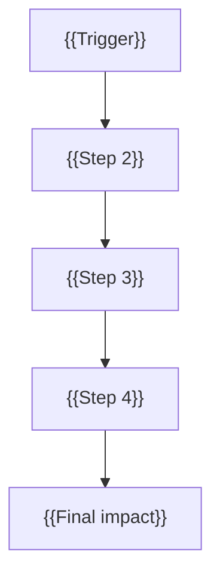

# OpenShift SRE Incident Report — {{TITLE}}

> **Status:** {{Healthy | Degraded | Failing | Recovering}} · **Severity:** {{Low | Medium | High | Critical}} · **Source:** {{live cluster | must-gather | both}}

---

## At a Glance

| | |
|:--|:--|
| **Cluster** | {{CLUSTER_NAME}} |
| **OpenShift** | {{OCP_VERSION}} |
| **Primary cause** | {{one sentence}} |
| **Impact window** | {{start}} → {{end}} (UTC) |
| **Top P0 action** | {{single most urgent remediation}} |

### Report metadata

| Field | Value |
|:--|:--|
| Report ID | {{REPORT_ID}} |
| Gather / analysis time | {{TIMESTAMP}} |
| Tool | kubernetes-mcp-server (`sre-agent.toml`) |
| Bundle / context | {{short path — full path in appendix if long}} |

---

## Contents

1. [Executive Summary](#1-executive-summary)
2. [Chain of Events](#2-chain-of-events)
3. [Primary Root Cause](#3-primary-root-cause)
4. [Secondary Causes](#4-secondary--contributing-causes)
5. [Impact Assessment](#5-impact-assessment)
6. [Cluster State](#6-cluster-state-at-capture)
7. [Remediation](#7-recommended-remediation)
8. [Workflow](#8-shareable-workflow)
9. [Appendix](#9-appendix--key-evidence)

---

## 1. Executive Summary

{{Paragraph 1: what happened, when, and cluster context in 2–3 sentences.}}

{{Paragraph 2: primary cause and mechanism in 2–3 sentences.}}

{{Paragraph 3: current state at capture and business impact in 1–2 sentences.}}

| | |
|:--|:--|
| **Primary cause** | {{one sentence}} |
| **Secondary causes** | {{comma-separated short list}} |
| **Ruled out** | {{etcd / network / capacity — brief}} |

---

## 2. Chain of Events

### Visual flow



### One-line chain

> {{trigger}} → {{step2}} → {{step3}} → {{final impact}}

### Timeline

| # | Time (UTC) | Event | Component | Impact |
|:-:|---|---|---|---|
| 1 | | | | |
| 2 | | | | |

<details>
<summary><strong>Extended timeline</strong> (optional — collapse if &gt; 8 rows)</summary>

| # | Time (UTC) | Event | Component | Impact |
|:-:|---|---|---|---|
| | | | | |

</details>

---

## 3. Primary Root Cause

| | |
|:--|:--|
| **Statement** | {{single clear root cause}} |
| **Evidence** | {{events, logs, operator messages — bullet list OK}} |
| **Mechanism** | {{cause → effect in plain language}} |
| **Why it mattered** | {{impact on availability or recovery}} |

### Ruled out (not root cause)

| Component | Verdict | Why |
|:--|:--|:--|
| etcd | OK / Not root | |
| Network (CNI/OVN) | Symptom / Not root | |
| Capacity | OK / Not root | |

---

## 4. Secondary / Contributing Causes

| Category | Issue | Evidence | Impact |
|:--|:--|:--|:--|
| Operators | | | |
| Monitoring | | | |
| Registry | | | |
| etcd / events | | | |
| Network | | | |

---

## 5. Impact Assessment

| Area | Impact | Duration |
|:--|:--|:--|
| Kubernetes API | | |
| OpenShift APIs | | |
| Authentication / Console | | |
| Monitoring | | |
| Ingress / Routes | | |
| User workloads | | |

---

## 6. Cluster State at Capture

### Nodes

| Node | Role | Status | Notes |
|:--|:--|:--|:--|
| | CP / Worker | Ready / NotReady | |

### etcd

| Metric | Value |
|:--|:--|
| Members | |
| Health | |
| Alarms | |
| Revision | |

### Cluster operators

| Operator | Available | Degraded | Summary |
|:--|:-:|:-:|:-:|
| | Yes/No | Yes/No | one line |

### Problem pods (top 5)

| Pod | Namespace | Symptom |
|:--|:--|:--|
| | | |

---

## 7. Recommended Remediation

### P0 — Do now

| # | Action | Why |
|:-:|---|---|
| 1 | | |
| 2 | | |

### P1 — This week

| # | Action | Why |
|:-:|---|---|
| 1 | | |

### P2 — Prevent recurrence

| # | Action | Why |
|:-:|---|---|
| 1 | | |

---

## 8. Shareable Workflow

### Tools used

| Step | Tool | Purpose |
|:-:|---|---|
| 1 | | |

### Reproduce

**Live cluster:** `/live-cluster-rca` with `sre-agent.toml` and `--port ""`

**Must-gather:**

```bash
tar -xzf must-gather*.tar.gz -C /path/to/extract/
# /must-gather-rca /path/to/extract/.../registry-sha-dir
```

### Who gets what

| Audience | Sections to share |
|:--|:--|
| SRE / Platform | Full report |
| Management | At a Glance + §1 + §5 + P0 from §7 |
| Red Hat support | Full report + bundle path |

---

## 9. Appendix — Key Evidence

<details>
<summary><strong>ClusterVersion / operator conditions</strong></summary>

```
{{paste YAML or condition snippets}}
```

</details>

<details>
<summary><strong>Key events and logs</strong></summary>

```
{{paste 3–5 evidence snippets}}
```

</details>

---

*Generated by kubernetes-mcp-server SRE agent · `sre-agent.toml`*
